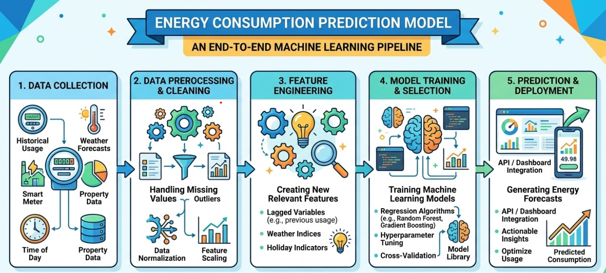
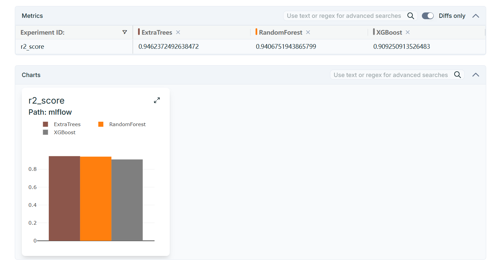
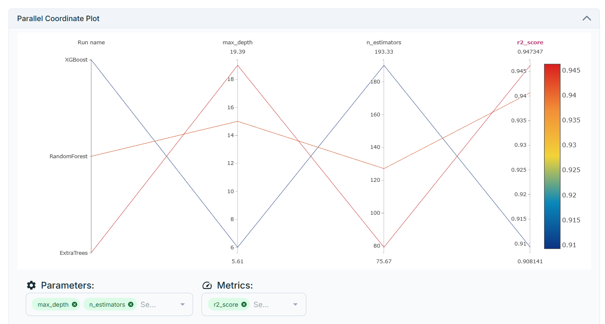

# **Energy Consumption Prediction Model**

--- 

## **Project Overview**

This project focuses on analyzing electricity consumption patterns in Tétouan, a city located in northern Morocco. The study leverages real-world data collected from the electricity distribution network to understand consumption behavior, identify trends, and support data-driven decision-making for energy management.

Tétouan has experienced steady population growth (~1.96% annually since 2014), which directly impacts energy demand. Given Morocco’s relatively low per capita energy consumption and dependence on imported oil products, efficient energy usage and forecasting are critical.


```
Note: 

The dataset is obtained from the Supervisory Control and Data Acquisition (SCADA) system operated by Amendis, responsible for electricity and water distribution in Tétouan since 2002.
```

---

```
Research Article:
Salam, Abdul Rahim and Abdelaaziz El Hibaoui. “Comparison of Machine Learning Algorithms for the Power Consumption Prediction : - Case Study of Tetouan city –.” 2018 6th International Renewable and Sustainable Energy Conference (IRSEC) (2018): 1-5. 
```

---



---

## **Monitoring Pipeline: Glimpses**





---
## **Contributions are welcome...** 

Feel free to:

- Fork the repository

- Create a feature branch

- Submit a pull request

---